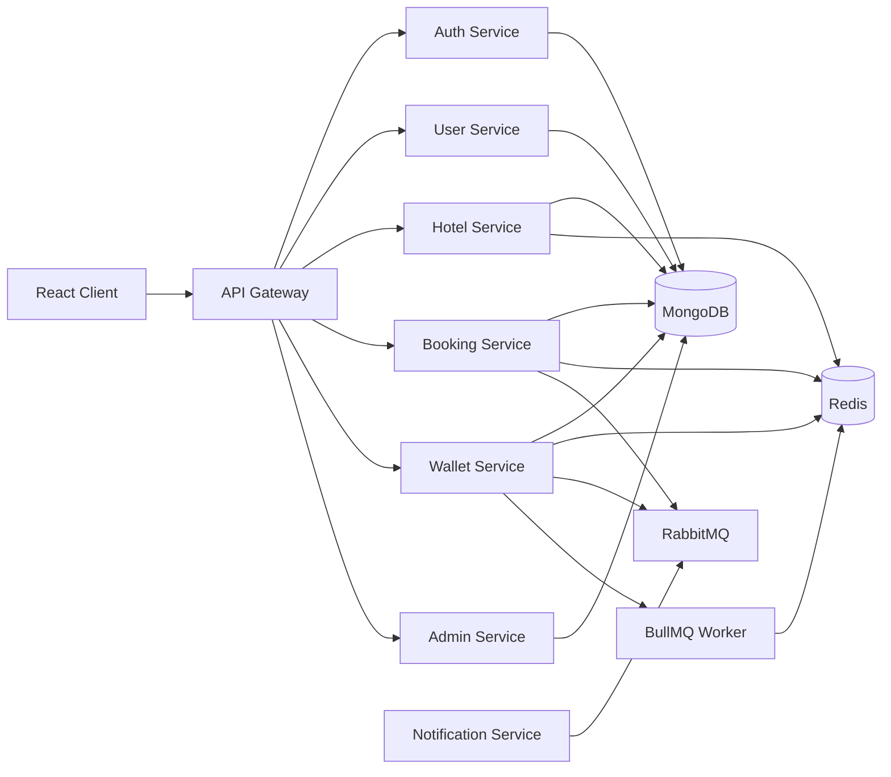
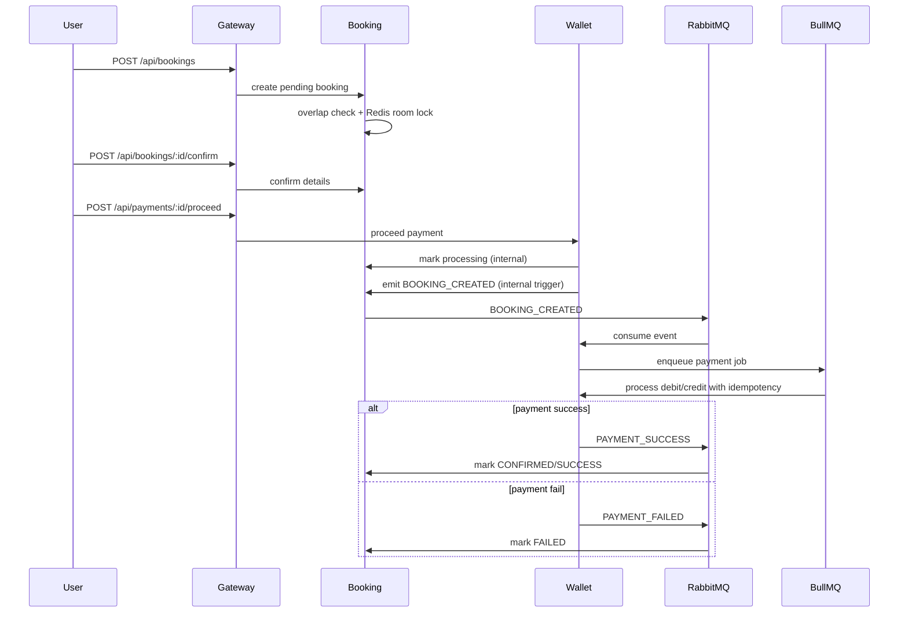

# Architecture Overview

## Booking + Payment Saga

## Service Boundaries

- `auth-service`: signup/login/refresh/logout and token issuance.
- `user-service`: user profile APIs.
- `hotel-service`: public hotel/room browsing plus privileged inventory endpoints.
- `booking-service`: booking lifecycle, room lock handling, booking status transitions.
- `wallet-service`: top-up, transactions, payment orchestration.
- `admin-service`: admin + superadmin management and analytics APIs.
- `notification-service`: payment-event notifications persistence.

## Architectural Patterns

- API Gateway Pattern
- Microservices with clean layered service modules
- Repository Pattern
- Service Layer Pattern
- DTO Validation Pattern
- Middleware Chain
- Event-Driven Saga (choreography)
- Queue-based retries (BullMQ)
- Idempotency keys + transaction uniqueness
- Audit logging for sensitive admin/superadmin actions
